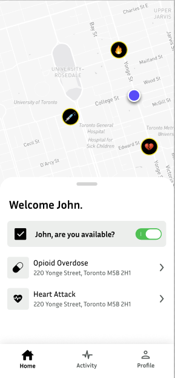
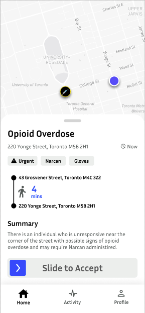
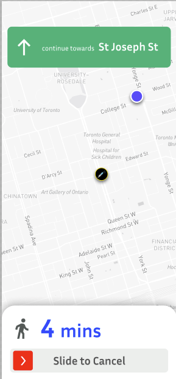
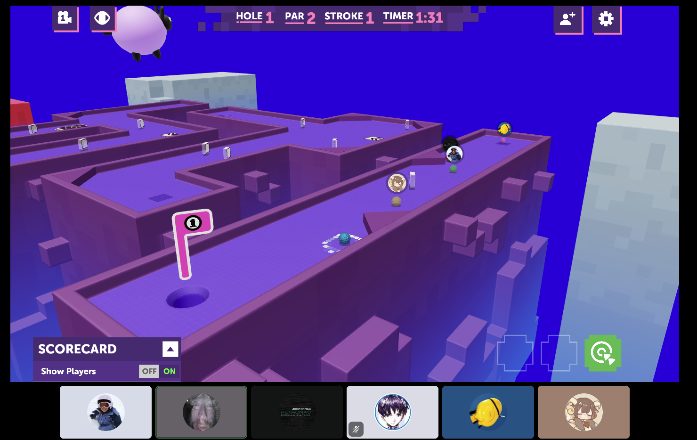
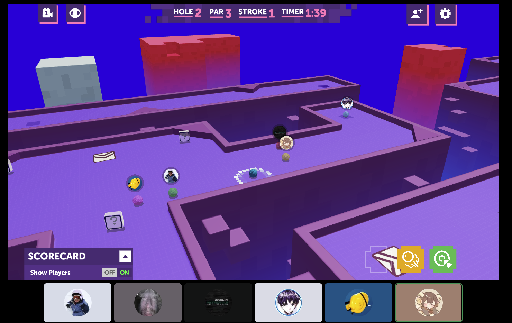
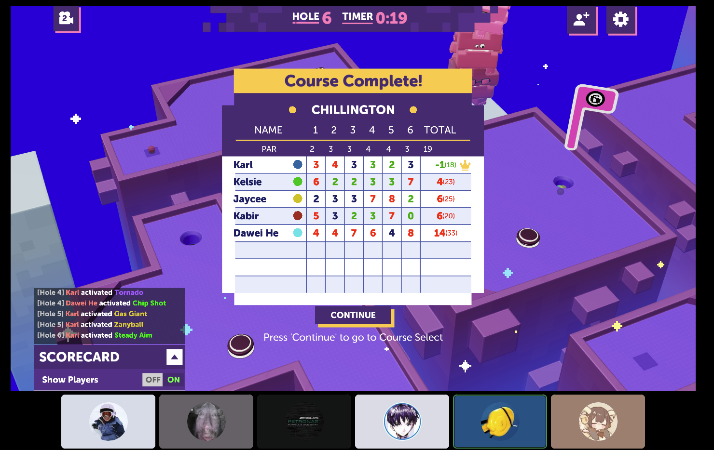

# YOUR PRODUCT/TEAM NAME
> _Note:_ This document will evolve throughout your project. You commit regularly to this file while working on the project (especially edits/additions/deletions to the _Highlights_ section).
> **This document will serve as a master plan between your team, your partner and your TA.**

## Product Details

#### Q1: What is the product?

The inspiration for the application comes from emergency situations that can arise in common public spaces. Take for example,
an individual in a crowded public street who is suddenly suffering signs of an opioid overdose. Someone on the street may
notice this and dial 911 to alert of this situation, which an operator may then ask if the caller has Narcan, a common
life-saving drug that can quickly reverse an opioid overdose. However, the chances of the caller possessing Narcan is
relatively low, and the time it takes for emergency services to arrive at the scene can be well above 10 minutes - too
long to recover from some overdoses. This is where we introduce our application, Engel. Engel serves as a platform for
911 operators to post real time emergencies happening through a web app which alerts good Samaritans using our mobile
application that a situation is arising nearby them. They are notified based on their skills such as if they are CPR
trained, possess Narcan, first aid qualified, and more. Good samaritans responding to an emergency in real time can help
drive down response times and possibly save a life.

Example (click to show)

  

Shown above is the home page, emergency overview page, and the enroute page for the mobile application.

#### Q2: Who are your target users?

**User 1 (911 Dispatchers)**: Sarah is a veteran emergency dispatcher who is trained to triage emergencies quickly and accurately.
She often receives calls about overdoses, cardiac arrests and unconscious individuals, and through experience
understands the importance of early intervention when it comes to saving lives.

**User 2 (Good Samaritans)**: Jason is a third-year university student, with aspirations of working in healthcare after graduation.
He spent his summer getting CPR-certified. Through previous experiences with overdoses he makes certain he has a Narcan
with him at all times.

#### Q3: Why would your users choose your product? What are they using today to solve their problem/need?

**911 Dispatchers** would choose Engel because it fills a critical gap in current emergency response systems. Today,
dispatchers rely on CAD systems and the original caller to manage emergencies until professional responders arrive,
which can take 15-20 minutes. Engel allows dispatchers to instantly notify nearby civilians with verified, relevant
skills (e.g., CPR, Narcan) without disrupting existing workflows. By enabling earlier on-scene intervention, Engel can
reduce response times by several minutes in time-sensitive emergencies such as overdoses or cardiac arrests, where early
action significantly improves survival outcomes, especially when resources are constrained.

**Good Samaritans** would choose Engel because it turns their training into actionable impact. Currently, trained
civilians have no reliable way to know when and where their skills are needed and must rely on chance or general alerts.
Engel provides real-time, location-based notifications for legitimate emergencies that match a user’s verified qualifications,
along with clear guidance and confirmation of need. This reduces uncertainty, increases safety and trust, and enables
civilians to respond confidently and effectively before emergency services arrive.

#### Q4: What are the user stories that make up the Minumum Viable Product (MVP)?

TBA

#### Q5: Have you decided on how you will build it? Share what you know now or tell us the options you are considering.

Engel will use a microservices-based architecture backed by Supabase as the core backend platform. Supabase will provide
authentication, a PostgreSQL database, real-time messaging, and row-level security. Business logic will be implemented
using TypeScript Edge Functions, which act as lightweight services for handling emergency creation, responder matching,
notifications, and access control. This approach allows individual services to scale independently while allowing the
team to focus primarily on the complex business logic and building out two separate frontends (the web interface for
dispatchers and the mobile app for good Samaritans). Third-party integrations under consideration include map services
(e.g., Open source mapping apis) for location handling.

The frontend will consist of two clients. A cross-platform mobile application for good Samaritans will be built using
React Native, enabling real-time emergency alerts, navigation, and “skill-based” filtering. A web application for 911
dispatchers will be built using React, providing a dashboard interface for posting and monitoring the active emergency.
Both clients will communicate with Supabase through secure APIs and real-time channels. The application will be deployed
using Supabase’s managed infrastructure, with frontend clients hosted on modern platforms such as Vercel for the web app,
enabling continuous deployment and scalability.

----
## Intellectual Property Confidentiality Agreement
> Note this section is **not marked** but must be completed briefly if you have a partner. If you have any questions, please ask on Piazza.

We do not have a partner. However, the team has decided to use the `GNU GENERAL PUBLIC LICENSE` (GPL), ensuring that the
software remains free and open-source, and that any modifications or redistributions preserve the same licensing terms.

----

## Teamwork Details

#### Q6: Have you met with your team?

We met online over the weekend via video chat for a few hours to play mini golf on Discord together while we discussed
some of our hobbies and interests, as well as brainstormed ideas for the project. In mini golf, we took turns hitting
our ball to the hole.
Some fun facts we learned about our team members were:

- Karl used to live in France, which was also what inspired our project
- Jaycee has a pet bird
- Kabir flies planes
- Greatman used to live in Tunisia
- Aryan can solve a rubix cube in less than 10 seconds

Team building (click to show)

  

#### Q7: What are the roles & responsibilities on the team?

**Jaycee (Database, Backend)** - She has some experience with SQL and databases through CSC343 and CSC309, and she is interested in learning more about how it can be integrated with the backend in this project. She will work on

**Matt(Backend/Database Preferred)** - Has taken CSC343: Introduction to Databases and CSC463: Computational Complexity and Computability in addition to required CS courses. Interested in putting to use his acquired skills in an applied project. For example, implementing backend logic or SQL that scales and designing algorithms. Lacks significant experience in other areas such as frontend.

**Aryan (Backend / Frontend Web Interface Preferred)** - Has taken CSC309 and is currently doing CSC343. Has completed external projects, applying skills towards backend-heavy projects (ORMs, external apis, and complex business logic), and is interested in creating scalable server side solutions that can handle many users.

**Greatman (Scrum master,Frontend Developer)** - Has worked on building frontend logic (using Flutter) of a location-based app which integrated maps and messaging similar to the current project.

Karl-Alexandre (Product Manager, Full-Stack developer) -  Has extensive experience developing and maintaining production full-stack applications, including work on MarkUs, and saycamel.com, social platform with 850+ registered users. He will act as Product Manager, defining product requirements, prioritizing features, and ensuring alignment with user needs. Technically, he will contribute across the stack, including backend services, API design, database integration, and frontend components, while also supporting system architecture and deployment decisions.

#### Q8: How will you work as a team?

**Meetings**: Recurring weekly in-person and/or online over Discord.

**Purpose**: Share updates from each person and their progress for the week, as well as next tasks to make sure we are all on the same page.

Meeting times for the semester:
1) Saturday: 2 hours 4-6pm
2) Tuesday: 1 hour 6:00-7:15pm

Since our team members may have conflicting schedules, we have decided that team members working on features together
can meet separately based on their schedule, and update the rest of the team.

#### Q9: How will you organize your team?

Our team will use Linear for managing backlog and sprints, GitHub will be used for version control, and Discord for communication.

**Keeping track of work**: All is tracked as Issues in the Linear Backlog.

**Task priorities**: Task priority is determined through team discussions on features which are most crucial for a MVP. We
utilize Linear’s built-in Priority Levels to assign priorities.

**Task assignment**: The person in assignee field in Linear will have sole responsibility for completing the task. Team
members will be assigned tasks from the “Todo” column based on discussions in team meetings.

**Task status tracking**: We use Linear’s Workflow States to track the exact lifecycle of a task.

**Communication**: Main team meetings will happen over Discord, where we have already set up different channels dedicated for general discussions, scheduling, and resources for each deliverable. We also plan to host our online meetings over Discord voice chat as well. Subteams (front-end, backend, database) will schedule and meet in person.

#### Q10: What are the rules regarding how your team works?

**Communication**: We will have mandatory weekly meetings via Discord voice/video channels on Tuesday between 6:00pm-7:15pm 
and/or Saturday between 4:00pm-6:00pm. Subteams (frontend, backend, database) will meet once a week in person at flexible 
times communicated during main team meetings and/or discord.

**Collaboration**: We will keep track of attendance for weekly meetings in the meeting minutes, and members are expected to 
review the meeting notes afterward if they cannot attend and/or provide updates through messaging instead. Subteams 
will also be required to provide meeting updates during main team meetings. If someone is unresponsive, we will try to 
reach out to them and provide support if possible, before seeking advice from our TA if necessary.

## Organisation Details

#### Q11. How does your team fit within the overall team organisation of the partner?

We do not have a partner.

#### Q12. How does your project fit within the overall product from the partner?

We do not have a partner.

## Potential Risks

#### Q13. What are some potential risks to your project?
* Now that you have defined your project, what risks can you identify that might impact it?
* Some examples of risks at this planning stage could include:
    * Uncertainties regarding a specific feature
    * Misaligned expectations or conflicts
    * Lack of clarity in execution or decision-making
    * Limited access to data, systems, or other dependencies
    * User stories that are too abstract or too simple
* For each risk, provide a brief bullet point and then explain the risk in detail.

#### Q14. What are some potential mitigation strategies for the risks you identified?
* Examples of mitigation strategies:
    * More communication with the partner might help with improving clarity.
    * Adding more details for an user story might make it less abstract.
    * Adding an extra user story might increase the project complexity, making it less simple.
* It's ok if you are unable to find mitigation strategies for all the risks right now.
